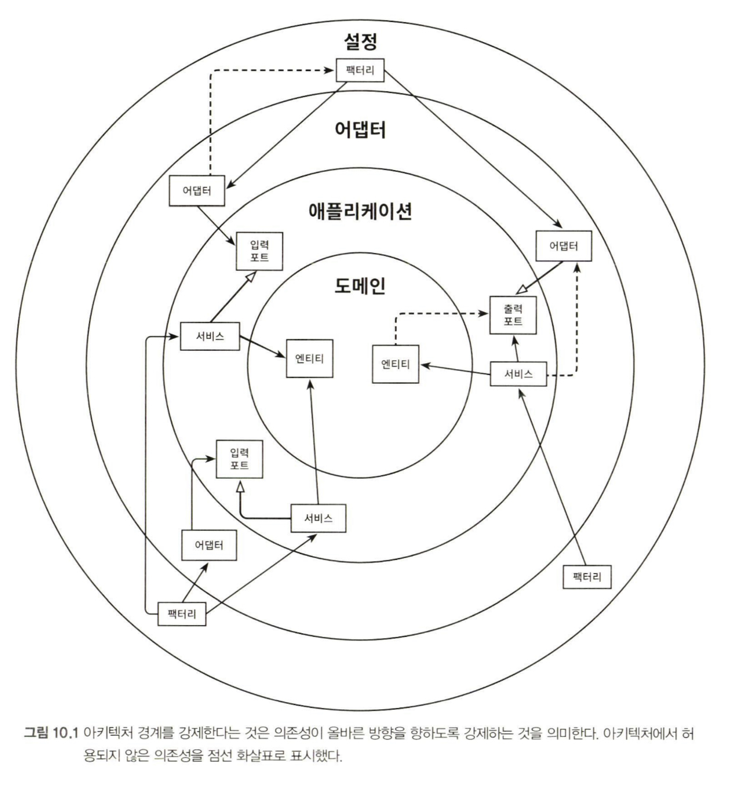
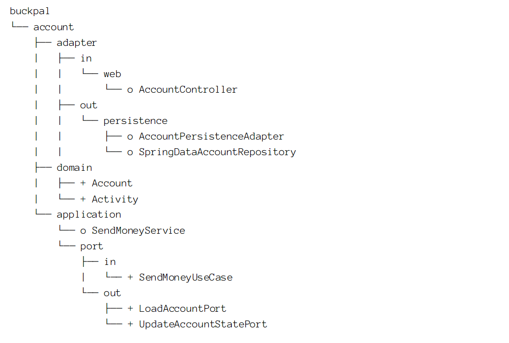
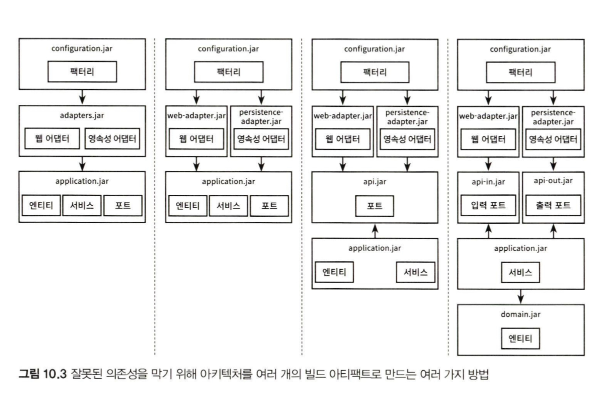

# 10. 아키텍처 경계 강제하기

## 1. 경계와 의존성
- 아키텍처의 경계와 '경계를 강제한다는 것'의 의미를 알아보자.



> 아키텍처의 경계를 강제한다는 것은 의존성이 올바른 방향을 향하도록 강제하는 것.

- 가장 안쪽 계층 
  - 도메인 엔티티
- 도메인 엔티티에 접근하는 애플리케이션 계층 
  - 유스케이스 구현
- 어댑터
  - 인커밍 포트를 통해 서비스 접근
- 서비스
  - 아웃고잉 포트를 통해 어댑터 접근
- 설정 계층
  - 어댑터 & 서비스 객체 생성용 팩터리 포함
  - 의존성 주입 매커니즘 제공

의존성은 항상 안쪽으로 향해야 한다.

<br>

## 2. 접근 제한자
- package-private 제한자의 중요성
  - 패키지를 통해 클래스들을 응집된 모듈로서 만들어준다.
  - 패키지 바깥 서는 접근 불가.
  - 모듈 진입용 클래스만 따로 public으로 만들면 된다.



- 경계간 외부로 드러난 port 를 이용한다
  - persistence 패키지에 있는 클래스들은 외부에서 접근할 필요가 없기 때문에 package-private 고려 가능.
  - SendMoneyService 도 같은 이유로 package-private 가능.

- package-private 단점
  - 클래스가 특정 개수를 넘어가면 혼란스러워짐
  -  이를 해결하기 위해 하위 패키지를 만들게 되면 다른 패키지로 취급되기 때문에 접근이 제한됨.

<br>

## 3. 컴파일 후 체크
- public 제한자를 사용하면 올바른 의존성 방향과 상관없이 접근 가능하므로 컴파일러는 전혀 도움이 되지 않는 상황.

- `컴파일 후 체크`를 고려해보자.
  - 런타임에 체크한다는 것.
  - CI 환경에서 자동화 테스트 과정에서 잘 동작함.
    - (무슨 의미인지 얘기 좀..)

- 자바용 도구로 `ArchUnit`이 있다.
  - 의존성 방향이 기대한 구성인지 체크하는 API 제공.
  - 위반 시 예외 던짐.
  - JUnit과 같은 단위 테스트 프레임워크 기반에서 잘 동작

<br>

```java
class DependencyRuleTest {

  @Test
  void domainLayerDoesNotDependOnApplicationLayer() {
    noClasses()
      .that()
      .resideInAPackage("buckpal.domain..")
      .should()
      .dependOnClassesThat()
      .resideInAnyPackage("buckpal.application..")
      .check(new ClassFileImporter().importPackages("buckpall.."));
    }
  }
}
```
- Fail-Safe 하지 않다.
  - 오타, 리팩토링 시 함께 유지보수가 필요함)
- 테스트 코드를 짜는데, 의존성을 위한 테스트 코드까지??

<br>

## 4. 빌드 아티팩트 
- 빌드 아티팩트
  - (아마도 자동화된) 빌드 프로세스의 결과물
    - 자바 세계에서는 Gradle, Maven 빌드 툴 이용
- 코드베이스가 의존하는 모든 아티팩트가 사용 가능한지 확인하는 것.
- 빌드 툴을 활용해 모듈과 아키텍처의 계층 간 의존성을 강제할 수 있다.
- 각 모듈 혹은 계층에 대해 전용 코드 베이스와 빌드 아티팩트로 분리된 빌드 모듈(Jar 파일)을 만들 수 있다.
  - 각 모듈의 빌드 스크립트에서는 아키텍처에서 허용하는 의존성만 지정
  - 컴파일 에러를 바로 뱉기 때문에, 실수로 잘못된 의존성을 만들 수 없다.

<br>

   
  - 모듈간 의존성 제어 가능
  - 순환 의존성을 허용하지 않음.
  - 특정 모듈의 코드를 격리한 채 변경 가능 (모듈 간 분리되어 있으므로)
  - 의존성이 빌드 스크립트에 분명히 명시되어 있으므로 의존성을 추가하는 일은 확실한 의식적인 행동이 됨. (의존성 추가 시 한번 생각해보라~)

