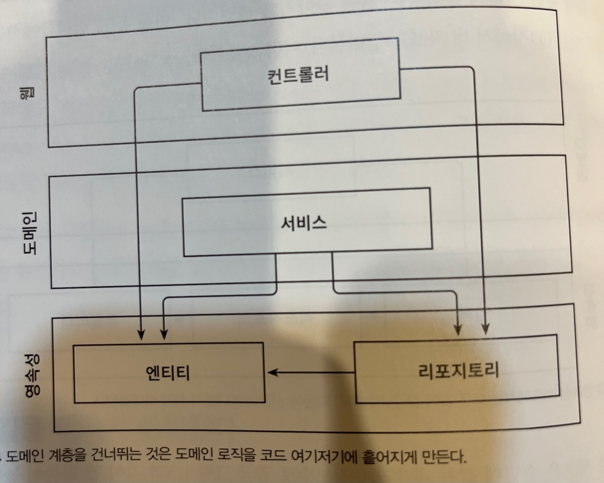
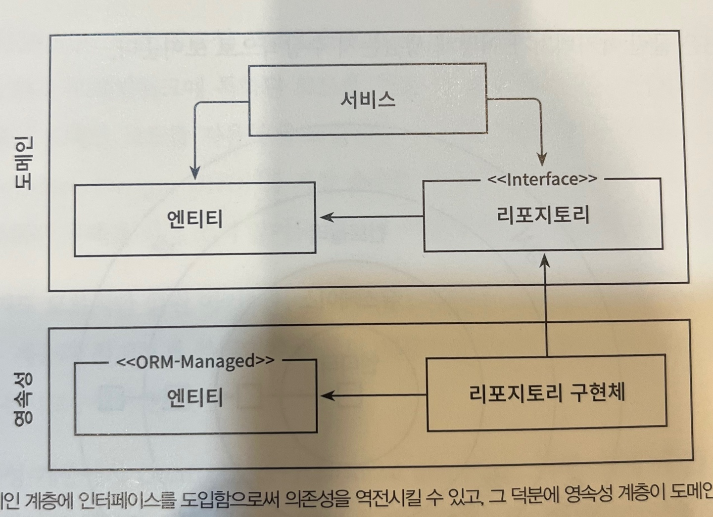
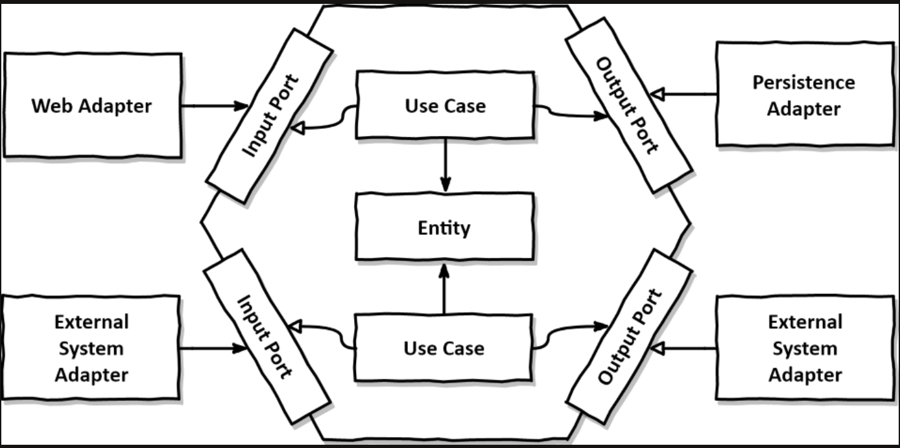

# 의존성 역전하기

## 단일책임의 원칙
> 컴포넌트를 변경하는 이유는 오직 하나뿐이어야 한다.
> 
> 즉 이말은, 외부에 의존성을 가지고 있는 컴포넌트에 의해 내가 변경 되는 것이 아니라,
> 
> 나 자신의 컴포넌트의 기능이 변경되어 바뀌는 경우 그 한가지가 컴포넌트를 변경하는 단하나의 이유여야 한다 라는 뜻이다.

## 의존성 역전 원칙
- 계층형 아키텍처에서 계층간 의존성은 항상 다음 계층인 아래 방향을 가리킨다.
- 즉, 상위 계층들이 하위 계층들에 비해 변경할 이유가 더 많아진다.

- 영속성 계층을 변경 할때마다, 잠재적으로 도메인 게층도 변경해야 할 수 있다.

> 코드 상의 어떤 의존성이든 그 방향을 바꿀 수 있다.

- 계층 간의 모든 의존성이 도메인 내부로 향하도록 한다.

> **나눠볼 얘기들**
> 
> 위 사진에서 두개의 엔티티가 있는데 만약 구현 한다면 어떤식으로 구현할지?

## 클린아키텍처 - 육각형 아키텍처

> 육각형 외부로 향하는 의존성이 없는 점에 주목하자.

## 결론
> 의존성을 역전 시켜 도메인 코드가 다른 바깥쪽 코드에 의존하지 않게 하는것이 
> 
> 영속성과 UI 에 특화 된 모든 문제를 줄일 수 있다.
