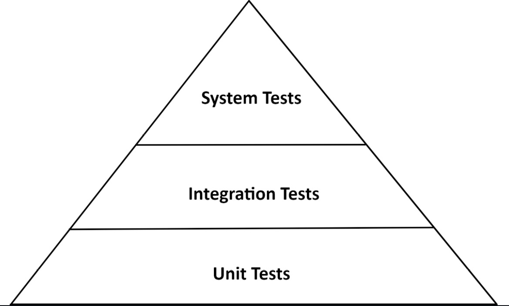

# 육각형 아키텍처에서 테스트 전략
## 테스트 피라미드

> "비용이 많이 드는 테스트는 지양, 적게 드는 테스트를 많이 만들자"
> 
> 기본적으로 테스트 작성 비용이 저렴하고 유지관리가 쉬운 단위 테스트가 프로젝트에서 가장 많은 테스트를 구성한다. 

## 단위 테스트 
- 일반적으로 하나의 클래스를 인스턴스화 하고 클래스의 인터페이스를 통해 기능들을 테스트 한다.
- 의존되는 클래스들은 mock 을 통해 대체한다.

1. 의존되는 클래스가 없을 경우.
~~~
class AccountTest {
	@Test
	void withdrawalSucceeds() {
		AccountId accountId = new AccountId(1L);
		Account account = defaultAccount()
				.withAccountId(accountId)
				.withBaselineBalance(Money.of(555L))
				.withActivityWindow(new ActivityWindow(
						defaultActivity()
								.withTargetAccount(accountId)
								.withMoney(Money.of(999L)).build(),
						defaultActivity()
								.withTargetAccount(accountId)
								.withMoney(Money.of(1L)).build()))
				.build();

		boolean success = account.withdraw(Money.of(555L), new AccountId(99L));

		assertThat(success).isTrue();
		assertThat(account.getActivityWindow().getActivities()).hasSize(3);
		assertThat(account.calculateBalance()).isEqualTo(Money.of(1000L));
	}
}
~~~

2. 의존되는 클래스가 있을 경우.
[코드 참조](https://github.com/wikibook/clean-architecture/blob/main/src/test/java/io/reflectoring/buckpal/account/application/service/SendMoneyServiceTest.java)

- 테스트 중인 유스케이스 서비스(SendMoneyService)는 상태가 없기 때문에 상태를 검증할 수가 없다.
- 그렇기 때문에 의존 대상의 특정 메서드와 상호작용 했는지 여부를 검증 한다.

- 이 테스트는 서비스가 모킹된 의존 대상 (ex AccountLock)의 특정 메서드(ex lockAccount())와 상호작용 했는지 여부를 검증한다. 
- 이건 테스트가 코드의 행동 변경 뿐만 아니라 코드의 구조 변경에도 취약해진다.

### 테스트를 많이 만드는 것이 좋을까?
- 코드가 리팩토링 되면, 테스트도 변경 될 확률이 높다.

> 테스트에서 어떤 상호작용을 검증하고 싶은지, 신중하게 생각하고 작성하자.
> 
> 모든 동작을 검증하는 것이 아닌, 중요한 핵심만 테스트를 작성하자.

## 통합테스트
> 연결된 여러 유닛을 인스턴스화하고 시작점이 되는 클래스의 인터페이스로 데이터를 보낸 후 유닛들의 네트워크가 기대한 대로 잘 동작하는지 검증.

## 웹 어댑터(in) 통합테스트
### 그전에...
- @WebMvcTest
> Present Layer 관련 컴포넌트만 스캔을 한다.
> 
> Service, Repository dependency가 필요한 경우에는 @MockBean으로 주입받아 테스트를 진행
> 
#### SpringBootTest 와 차이점.
> 모든 빈을 로드하기 때문에 테스트 구동 시간이 오래 걸리고, 테스트 단위가 크기 때문에 디버깅이 어려울 수 있다.
> 
> Controller 레이어만 슬라이스 테스트 하고 싶을 때 사용가능.
- @MockMvc
> 애플리케이션을 배포하지 않고도, 서버의 MVC 동작을 테스트 할 수 있는 라이브러리.

### 코드 
[코드참조](https://github.com/wikibook/clean-architecture/blob/main/src/test/java/io/reflectoring/buckpal/account/adapter/in/web/SendMoneyControllerTest.java)

### 하나의 클래스를 테스트 하는데, 왜 통합테스트 일까?
- @WebMvcTest
> 스프링이 특정 요청 경로, 자바와 Json 간의 매핑 등에 필요한 전체 객체 네트워크를 인스턴스 하도록 만든다.(내부적으로 이런 일들이 벌어지고 있음)

- 웹 컨트롤러가 스프링 프레임워크에 강하게 묶여 있기 때문에, 이 프레임워크와 통합된 상태로 테스트 하는 것 이 합리적.

## 웹 어댑터(out) 통합테스트
- 단순히 어댑터 로직만 검증하고 싶은게 아니라 데이터베이스 매핑도 검증하고 싶기 때문에 통합 테스트가 합리적.

### 그전에...
- @DataJpaTest (데이터베이스에 접근에 필요한 객체 네트워크를 인스턴스화)
> JPA 관련 테스트 설정만 로드. 
> 
> DataSource의 설정이 정상적인지, JPA를 사용하여 데이터를 제대로 생성, 수정, 삭제하는지 등의 테스트가 가능. 
> 
> 내장형 데이터베이스를 사용하여 실제 데이터베이스를 사용하지 않고 테스트 데이터베이스로 테스트할 수 있다.
- @Import(특정 객체가 해당 네트워크에 추가 됐다는 것을 명확하게 표현)
- @Sql
> sql 스크립트를 통해서 DB를 원하는 상태로 만들 수 있다.

### 코드
[코드참조](https://github.com/wikibook/clean-architecture/blob/main/src/test/java/io/reflectoring/buckpal/account/adapter/out/persistence/AccountPersistenceAdapterTest.java)

### 정리
- 테스트는 실제로 데이터베이스 접근. (모킹 X) 
- 주의할점은 실제 운영에서는 인메모리 DB 를 잘 사용하지 않기 때문에, 실제 데이터베이스에서 문제가 생길 가능성이 있음.
- 예를 들면 고유한 SQL 문법이라던가, 데이터베이스 서버가 여러개이고 다른 DBMS 를 쓴다던가 등의 상황

> TestContainers 라이브러리를 통해 필요한 데이터베이스를 도커 컨테이너에 띄울 수 있다.

## 시스템 테스트
> 애플리케이션을 구성하는 모든 객체 네트워크를 가동시켜 특정 유스케이스가 전 계층에서 잘 동작하는지 검증.
> 
> 전체 애플리케이션을 띄우고, API 를 통해 요청을 보내고 모든 계층이 조화롭게 잘 동작하는지 검증.

### 그전에...
- @SpringBootTest
> 스프링이 애플리케이션을 구성하는 모든 객체 네트워크를 띄우게 한다.

- TestRestTemplate
> MockMvc 와 달리 실제 HTTP 통신을 할 수 있다.

### 코드
[코드 참조](https://github.com/wikibook/clean-architecture/blob/main/src/test/java/io/reflectoring/buckpal/SendMoneySystemTest.java)

### 정리
- 시스템 테스트를 사용자가 애플리케이션을 사용하면서 거쳐갈 특정 경로 등을 시나리오로 만들어,
- 테스트를 통해 시나리오를 검증 하는 식으로 작성해보자.

## 얼마만큼의 테스트가 충분할까?
- 얼마만큼의 커버리지를 채워라 보다는 테스트를 실행한 후에 소프트웨어를 배포해도 될만큼 신뢰 할 수 있을 정도면 충분하다.
### 버그가 발생했을때의 태도
- "테스트가 왜 이 버그를 잡지 못했을까?" 를 생각하고, 이에 대한 답변 기록, 커버 할 수 있는 테스트 작성.

## 육각형 아키텍처에서 사용하는 테스트 전략
1. 도메인 엔티티를 구현 할 때는 단위 테스트를 이용하자.
2. 유스케이스를 구현 할 때에는 단위테스트를 이용하자.
3. 어댑터를 구현할 때에는 통합테스트를 이용하자.
4. 사용자가 취할 수 있는 애플리케이션 경로는 시스템 테스트를 이용하자.

## 테스트에서도 빛나는 육각형아키텍처의 장점
- 핵심 도메인로직은 단위테스트로, 어댑터는 통합테스트로 명확한 테스트 전략 정의 가능.
- 입출력 포트는 테스트에서 명확한 모킹 지점이 된다. (포트를 아주 작고 핵심만 담는 적은 메서드의 인터페이스로 만드는것이 여기서 빛을 볼 것이다.)
- 모킹하는것이 버거워지거나, 어떤 종류의 테스트를 써야 할지 모르겠다면, 아키텍처에 대해서 다시 설계해볼 필요가 있다.
