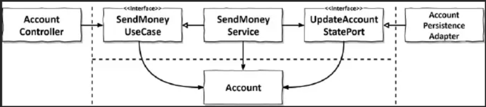
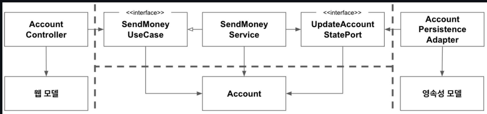
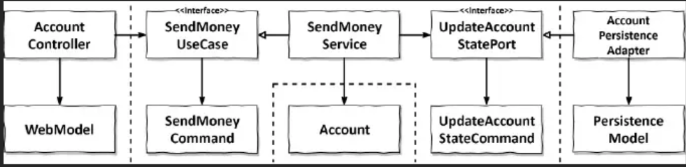
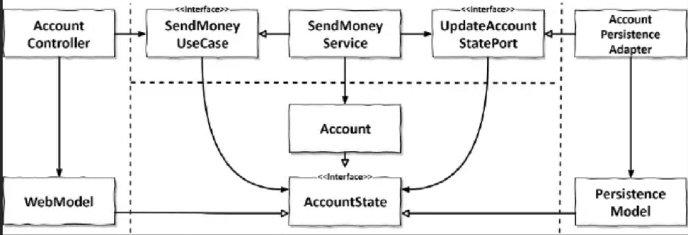

# 경계간 매핑하기
## 매핑 VS 노매핑 각각의 장단점
- 매핑 찬성
> 두 계층간 매핑을 하지 않으면 양 계층에서 같은 모델을 사용해야 하는데, 두계층이 강하게 결합된다.
- 매핑 반대
> 두 계층간 매핑을 하게되면 보일러플레이트 코드를 너무 많이 만들게된다.
> 
> 많은 유스케이스들이 오직 CRUD 만 수행하고 계층에 걸쳐 같은 모델을 사용하기 때문에 계층사이의 매핑은 과하다.

## 매핑 전략
1. 매핑하지 않기 전략

- Account 클래스는 웹, 애플리케이션, 영속성 계층과 관련된 이유로 인해 변경돼야 하기 때문에 단일 책임 원칙을 위반한다.
- 모든 계층이 정확히 같은 구조의, 정확히 같은 정보를 필요로 한다면 '매핑하지 않기' 전략은 완벽한 선택지다. 

2. 양방향 매핑 전략

- 각 계층은 도메인 모델과는 완전히 다른 구조의 전용 모델을 가지고 있다.

> 나눠볼 얘기  
> 
> 웹 계층에서는 웹 모델을 인커밍 포트에서 필요한 도메인 모델로 매핑하고, 
> 인커밍 포트에 의해 반환된 도메인 객체를 다시 웹 모델로 매핑한다.
> 
> 다들 어떤식으로 구현 할꺼야? :: 
> - 웹 모델 :: ConvertDomainModel
> - 도메인 모델 :: ConvertWebModel 
>
> 어떤걸 넘기고 어떤걸 받아야 할까.

- 웹이나 영속성 관심사로 오염되지 않은 깨끗한 도메인 모델 (SRP 만족)
- 간단하면서도 매핑 책임이 명확하다.

- 보일러플레이트 코드 
> 매핑 프레임워크가 있다는 사실... 하지만 디버깅이 쉽지 않다고 합니다.
- 도메인 모델이 계층 경계를 넘어서 통신하는데 사용된다 (포트가 도메인 객체를 입력파라미터와 반환값으로 사용한다)

### 양방향 매핑 전략 결론
> 이것이 클린아키텍처이다. 이것은 아니다.
> 
> 간단한 CRUD 에서는 이런 아키텍처는 리소스 낭비이므로, 상황에 맞게 적절한 전략을 선택하자.
3. 완전 매핑 전략

- 이 매핑 전략에서는 각 연산마다 별도의 입출력 모델을 사용한다.
- 각 작업에 특화된 모델을 사용.

- command 객체는 애플리케이션의 인터페이스를 해석할 여지없이 명확하게 만들어준다
> 도현이와 스터디중 :: 얘기 했던 내용. 도현이 기억하늬?

- 각 유스케이스는 전용필드와 유효성 검증로직을 가진 전용 커맨드를 가진다
> 모르겠는 내용
> 
> 잘 이해가 안된다..(102pg - 어떤 필드를 채울지 ...)

- 유지보수 하기 쉽다.
- 더 많은 코드를 써야한다.

### 완전 매핑 전략 결론
- 전역패턴으로는 추천하지 않는다.
- 인커밍 어댑터와 어플리케이션 계층사이에서 상태 변경 유스케이스의 경계를 명확하게 할때 유용하다. 
> 모르겠는 내용과 조금 이어진듯함.. 위에 내용 얘기 나눠보고 한번더 생각해보자.
- 영속성 계층과 애플리케이션 계층 사이에서는 매핑 오버헤드 때문에 사용하지 않는것이 좋다.
> **예를 한번 생각해보자.**
- 매핑전략은 섞어 써야만한다. 모든 계층에 걸쳐 전역규칙일 필요가 없다.

4. 단반향 매핑 전략

- 모든 계층의 모델들이 같은 인터페이스를 구현한다.
- 관련 있는 특성에 대한 getter 메서드를 제공하여, 도메인 모델의 상태를 캡슐화 한다.
- 매핑 책임이 명확하다 (한 계층이 다른 계층으로부터 객체를 받으면 해당 계층에서 매핑한다)

- 매핑이 계층을 넘나들며 퍼져있기 때문에 개념적으로 어렵다

> 계층간 모델이 비슷할때, 유용하다.

## 한걸음 더..
- 포트에서 계층 사이의 매핑을 수행할지의 여부와, 어떤 매핑전략을 선택할지 포함한다. 
- **유스케이스에 대해 좁은 포트를 사용하면**, 유스케이스 마다 다른 매핑 전략을 사용 할 수 있고, 
- 다른 유스 케이스에 영향을 미치지 않으면서 코드를 개선 할 수 있다.